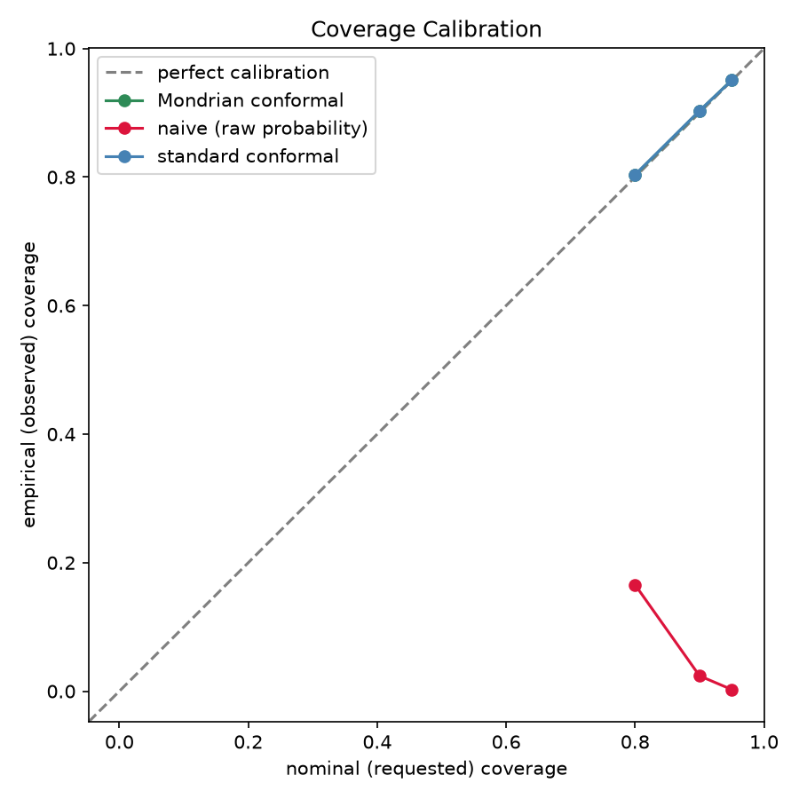

# Conformal Prediction for Loan Default Risk

A framework that wraps a standard credit-risk model's predictions with
statistically valid, distribution-free uncertainty intervals, using conformal
prediction — implemented by hand and cross-checked against
[MAPIE](https://mapie.readthedocs.io/).

## The problem this solves

A gradient-boosted model predicting loan default outputs numbers like "70%
probability of default." It's tempting to read that as a confidence
statement — but nothing about how the model was trained guarantees it. In
practice, predicted probabilities are frequently miscalibrated: a bucket of
applicants the model scored around 0.77 in this project's run actually
defaulted at a 27% rate, not 77% (see the reliability chart below). The model
still *ranks* applicants correctly — riskier applicants get higher scores —
but the raw number is not a trustworthy probability.

**Conformal prediction** fixes this without retraining or reshaping the
underlying model. Using a held-out calibration set — data the model never
trained on — it measures how wrong the model's confident predictions
actually were, historically, and uses that to construct prediction sets with
a guaranteed coverage rate: "the true outcome falls in this set at least 90%
of the time," across any model, any data distribution, as long as the
calibration and test data are exchangeable. That's the entire assumption —
no normality, no specific error distribution, nothing about how the
underlying model works internally.

### Why this matters more in lending than in a low-stakes prediction context

In most ML applications, a slightly overconfident model is an inconvenience.
In lending, the confidence number itself often drives a decision — how much
to reserve for expected losses, whether an application needs manual review,
what interest rate to charge. If that confidence is systematically wrong,
every downstream decision built on it inherits the error, without anyone
being able to see it from the model's output alone.

It gets worse than a single global miscalibration. A model can hit the right
*average* coverage across an entire test set while being badly wrong for a
specific subgroup — undercovering low-income applicants' risk while
overcovering high-income applicants', and the errors cancel out in the
aggregate number. In lending, that's not a statistical curiosity, it's a
fairness problem: the applicants whose risk estimates are least reliable are
rarely a random subset. This project demonstrates that failure mode
directly (see "Standard vs. Mondrian conformal prediction" below) and shows
how **Mondrian (group-conditional) conformal prediction** fixes it by
guaranteeing coverage *within* each segment, not just on average.

## Dataset

[Home Credit Default Risk](https://www.kaggle.com/c/home-credit-default-risk)
(Kaggle), `application_train.csv` only — 307,511 rows, one row per loan
application. `TARGET` is the binary default flag (~8.1% positive class,
genuinely imbalanced). The auxiliary bureau/POS_CASH tables are intentionally
out of scope; this project is about the uncertainty-quantification layer, not
squeezing out maximum predictive accuracy.

The data ingestion layer (`data.py`) works with any CSV that has an ID column
and a binary target column, not just this one — Home Credit is the dataset
used to demonstrate it, not a hardcoded assumption.

### Missing data strategy

Roughly 40% of the columns in this dataset are missing on the large majority
of rows (building/apartment detail fields only populated for a subset of
applicants). Rather than imputing those and pretending the missingness isn't
informative, columns missing on more than `max_missing_fraction` (default
40%) of the training set are dropped entirely — imputing a value for the
majority of a column just encodes "was this missing," not real signal.
Remaining numeric columns are median-imputed; categorical columns get an
explicit `"Missing"` category rather than being silently dropped. `72` of
the original `122` columns survive this into the model.

One dataset-specific fix: `DAYS_EMPLOYED` uses `365243` as a sentinel for
"not currently employed" instead of a null (a well-documented quirk of this
dataset). Left alone, it reads as someone employed for 1000 years and
corrupts the median and any tree split that treats it as a real duration —
it's converted to a proper missing value before imputation.

## The three-way split

Training a model, calibrating conformal prediction, and evaluating coverage
all need to happen on *different* rows:

- **Train** (60%) — fits the XGBoost model.
- **Calibration** (20%) — never seen during training; used to measure how
  wrong the trained model actually is (its nonconformity scores).
- **Test** (20%) — never seen during training *or* calibration; used only to
  check whether the coverage guarantee actually held.

Reusing training data for calibration would understate the model's real
error — it always looks more confident on rows it memorized — and would make
the resulting intervals too narrow on genuinely new applicants. All three
splits are stratified on `TARGET` so each keeps the same ~8% default rate;
with a base rate this low, an unlucky split could otherwise leave calibration
with too few positive examples to estimate scores for reliably.

## How to run it

```bash
python -m venv .venv
source .venv/bin/activate
pip install -e ".[dev]"

# Requires a Kaggle account that has accepted the competition rules at
# https://www.kaggle.com/competitions/home-credit-default-risk/rules
pip install kaggle
kaggle competitions download -c home-credit-default-risk -f application_train.csv -p data/
cd data && unzip application_train.csv.zip && cd ..

python scripts/run_pipeline.py               # trains the model, runs every diagnostic, writes charts to reports/
pytest tests/ -v                              # 31 tests: hand-checked math, simulated-data coverage, edge cases

# optional: interactive walkthrough with the same steps shown inline
python -m ipykernel install --user --name conformal-credit-risk
jupyter lab notebooks/pipeline_walkthrough.ipynb
```

`notebooks/pipeline_walkthrough.ipynb` runs the identical pipeline as
`scripts/run_pipeline.py`, cell by cell, with each intermediate result (split
sizes, AUC, the reliability table, per-group coverage, the MAPIE comparison,
both charts) shown inline as you go — useful for stepping through the
reasoning interactively rather than reading console output. It's already
executed and saved with real output from the full dataset; open it directly
to read the results without re-running anything.

## Results (real run against the full 307,511-row dataset)

Base model: XGBoost, AUC ≈ 0.75 on the test split (using `application_train.csv`
alone, without the bureau/credit-history tables — consistent with published
baselines that use this subset).

### The naive baseline is wrong

Bucketing test-set predictions into deciles and comparing the mean predicted
probability in each bucket to the actual observed default rate:


The top decile's mean predicted probability was 0.77; the actual default
rate in that decile was 0.27. Mean absolute calibration gap across deciles:
**0.33**. This isn't unusual — probabilities are commonly rebalanced
(`scale_pos_weight` here) to fix the model's decision boundary for a rare
positive class, which inflates the probability scale without making it
usable as a calibrated confidence number. The ranking is still useful (AUC
0.75); the number attached to it is not.

### Split conformal prediction closes the gap

Nonconformity scores computed on the calibration set (`1 - P(true label)`),
turned into prediction sets on the test set via the standard finite-sample
quantile correction:

| nominal coverage | empirical coverage (hand-rolled) | empirical coverage (MAPIE) |
|---:|---:|---:|
| 80% | 80.37% | 80.37% |
| 90% | 90.32% | 90.32% |
| 95% | 95.06% | 95.06% |

The hand-rolled implementation and MAPIE's `SplitConformalClassifier`
(`conformity_score="lac"`) agree to within floating-point noise — used here
purely as a correctness check on the from-scratch code, not as a dependency
of the pipeline itself.

### Standard vs. Mondrian conformal prediction

At 90% nominal coverage, standard (pooled) conformal prediction hits close to
90% overall — but breaks down by income bracket, it ranges from 89.2% to
92.2%: the highest-income bracket is meaningfully overcovered while a
middle bracket is undercovered, even though the *average* looks fine.

Mondrian conformal prediction fits a separate threshold per income bracket,
so each group's coverage lands within a point of the 90% target
individually — the guarantee holds *within* the segment that matters, not
just in aggregate. It costs some efficiency (each threshold is fit on a
smaller per-group calibration sample, and set sizes shift accordingly), but
that's the honest price of a guarantee that holds where someone would
actually check it.

### Coverage calibration chart — the headline result

Sweeping nominal coverage across 80% / 90% / 95%, for all three approaches:



Standard and Mondrian conformal prediction track the diagonal almost
exactly. The naive baseline collapses toward *zero* empirical coverage as
the requested confidence increases — a direct consequence of the same
probability inflation shown in the reliability curve: a naive uncalibrated
threshold derived straight from the requested coverage level moves the wrong
direction once the raw probabilities are inflated.

## Project structure

```
src/conformal_credit_risk/
    config.py          typed, validated settings (pydantic) for every threshold used below
    data.py             CSV loading, validation, cleaning, three-way split
    model.py            the wrapped model: XGBoost predicting default probability
    naive_baseline.py   the "before" picture -- raw probability vs. observed rate
    conformal.py        split conformal prediction, implemented by hand
    mondrian.py          group-conditional conformal prediction
    mapie_check.py       cross-check of conformal.py against the MAPIE library
    coverage_report.py  sweeps coverage levels across all three methods
    plotting.py          the two report charts
scripts/run_pipeline.py  runs everything end to end, writes reports/
notebooks/                interactive walkthrough of the same pipeline, already executed
tests/                    31 tests: hand-checked math, simulated-data ground truth, edge cases
```

## Citation

Vovk, V., Gammerman, A., & Shafer, G. (2005). *Algorithmic Learning in a
Random World.* — the foundational text for conformal prediction, including
the finite-sample quantile correction and Mondrian conformal prediction used
here.

Sadinle, M., Lei, J., & Wasserman, L. (2019). *Least Ambiguous Set-Valued
Classifiers With Bounded Error Levels.* — the nonconformity score
(`1 - P(true label)`) used in `conformal.py`.

Home Credit Group. *Home Credit Default Risk* (Kaggle competition, 2018).
https://www.kaggle.com/c/home-credit-default-risk
